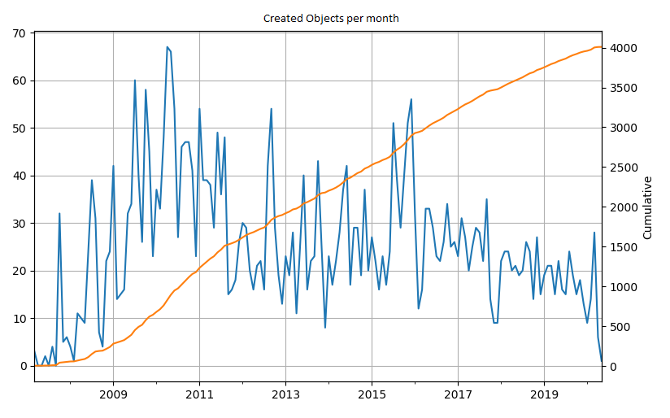
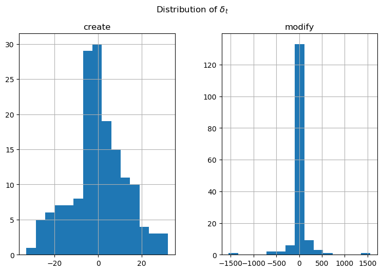

# OSMEvolution  🌍 📈

[](https://pepy.tech/project/OSMEvolution/week)
[](https://pepy.tech/project/OSMEvolution/month)

A package for receiving and restructuring OSM historic object data conveniently. Works for arbitrary OSM objects and all cities.


## Installation

```bash
$ pip install OSMEvolution
```

## Usage

```python3
from OSMEvolution.collect import DataCollector

# Initialize the data collector for the desired city.

>>> collector = DataCollector(city="Berlin")  
```

```python3
# Retrieve static data of the objects of interest (OOI).
# The object is defined by
      # 1. its object type (according to the OSM spatial data model).
      # 2. its object properties.
      
      
# As an example, we request the data for restaurants in Berlin, whose "amenity"-key was valued as "restaurant".
# More granular queries can be done by adding properties to the properties list.


>>> collector.get_objects(object_type="node", properties=["amenity=restaurant"])

# The descriptive (static) data of the objects of interest can now be accessed.
# The static data is a pandas DataFrame object.

>>> static_data = collector.data.get("static").copy()
>>> static_data.head()

         id  ...                  location
0  26735749  ...   (52.506911, 13.3228214)
1  26735759  ...  (52.5062119, 13.3180811)
2  26735763  ...  (52.5073199, 13.3207804)
3  29997724  ...  (52.5063184, 13.2846256)
4  30020303  ...  (52.4907103, 13.3939814)


# Now the historic data of the selected objects are requested, aggregated and restructured.
# To construct a proper time series, we need to specify the frequency of the series, here we choose monthly data.
>>> collector.build_timeseries(frequency="m")     

Collecting historic data: 100%|████████████| 4055/4055 [07:44<00:00,  5.30it/s]
Extracting historic entries: 100%|█████████| 4010/4010 [00:14<00:00, 3931.60it/s]

# The historic data and all other data that was produced during restructuring can be accessed via 
>>> collector.data.keys()

dict_keys(['static_raw', 'static', 'raw_history', 'historic_entries', 'timeseries'])

# Accessing the actual timeseries.
>>> timeseries = collector.data.get("timeseries").copy()
>>> timeseries

            create  delete  modify  ...  loc_change  new_mapper  activity
2007-03-31       3       0       0  ...           0           1         3
2007-04-30       0       0       0  ...           0           0         0
2007-05-31       0       0       0  ...           0           0         0
2007-06-30       2       0       0  ...           0           1         2
2007-07-31       0       0       0  ...           0           0         0
           ...     ...     ...  ...         ...         ...       ...
2020-01-31       9       0     124  ...          22          16       133
2020-02-29      14       1     121  ...          27          10       137
2020-03-31      28       0     183  ...          47          13       211
2020-04-30       6       0     116  ...          22          16       122
2020-05-31       1       0      39  ...           4           9        40

[159 rows x 10 columns]

>>> timeseries.describe()

           create      delete       modify  ...  loc_change  new_mapper     activity
count  159.000000  159.000000   159.000000  ...  159.000000  159.000000   159.000000
mean    25.220126    0.163522   136.823899  ...   26.716981   14.842767   162.371069
std     13.986724    0.583249   166.205513  ...   17.304471    8.318452   170.133140
min      0.000000    0.000000     0.000000  ...    0.000000    0.000000     0.000000
25%     16.000000    0.000000    69.000000  ...   16.500000    9.000000    98.000000
50%     23.000000    0.000000   113.000000  ...   24.000000   14.000000   141.000000
75%     32.500000    0.000000   156.500000  ...   34.500000   20.000000   184.000000
max     67.000000    5.000000  1690.000000  ...  127.000000   37.000000  1747.000000

# Plotting, as usual using pandas.DataFrame methods.

# Looking at all timeseries'
>>> timeseries.plot(grid=True, title="monthly development", ylim=(0, 1000))
```


```python3

# Object Evolution (created objects)
>>> timeseries.create.plot(grid=True, title="Created Objects per month");timeseries.create.cumsum().plot(grid=True, secondary_y=True);plt.ylabel("Cumulative")
```



```python3
# Delta distribution for the two major variables, create and modify
>>> timeseries[["create", "modify"]].diff().hist(bins=15);plt.suptitle("Distribution of $\delta_t$")
```


## Further Examples

#### Schools of New York

```python3

from OSMEvolution.collect import DataCollector

>>> collector = DataCollector(city="New York")

>>> collector.get_objects(object_type="node", properties=["amenity=school"])

>>> collector.build_timeseries(frequency="m")

```

## To Do and future work

- buildin Forecasting methods
- option to impute outliers
- MultiObject requests
